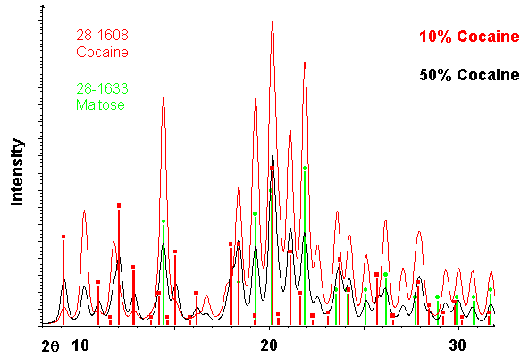

```{r setup, include=FALSE}
knitr::opts_chunk$set(echo = TRUE)
```

## Datos personales

Fecha de nacimiento: 27 junio 1992  
Edad:29  
Nacionalidad: Mexicana  

## Formación académica
#dos espacios en blanco para salto de linea   
Licenciatura: Químico Biologo Parasitologo  
Maestría: Recursos Naturales     
2019-2021  

## Contacto y redes sociales   
Correo electronico: cuaxinque-@outlook.com  
Facebook: [Gustavo Cuaxinque Flores](https://www.facebook.com/)  
Twitter: [Cuaxinque-Flores](https://twitter.com/home)  

## Ejercicio links a documentos

## Reporte
Este es mi primer reporte para GitHub, aquí encontrarás los resultados de la práctica. Para ver el contenido hacer clic [aqui](./docs/1-s2.0-S0304389421014448-main.pdf)

## Agregar otro link a otra red social o un link de descarga 

## Gráficas  
Histrograma 
hist(iris$Sepal.Length)
```{r}
hist(iris$Sepal.Length)
```
plot:
```{r}
plot(iris$Sepal.Length, iris$Petal.Length, col = iris$Species)
```
